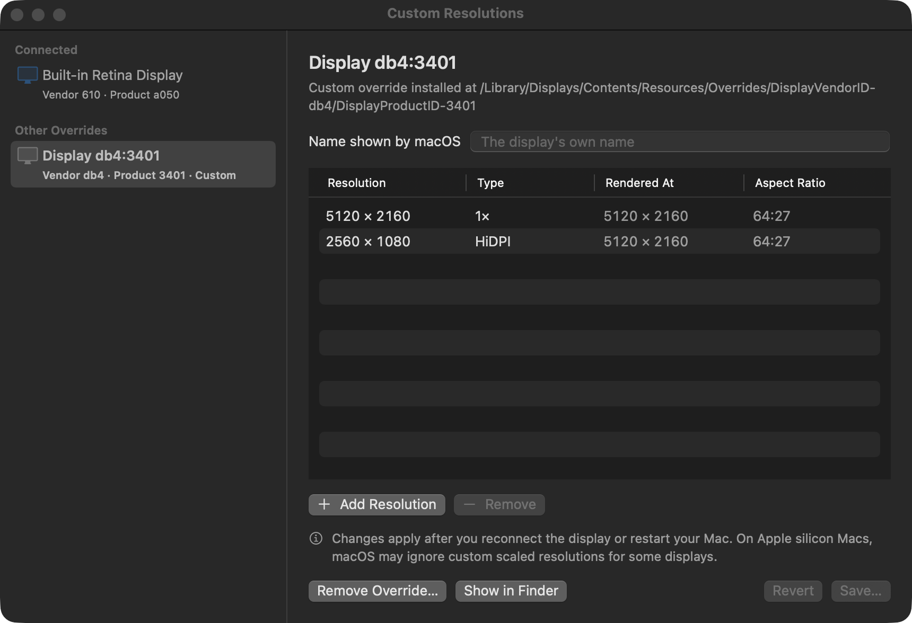

# Resolute

Choose the resolutions and refresh rates your Mac exposes from the menu bar, including validated modes System Settings hides.

Resolute is a Swift menu-bar app and command-line tool inspired by [RDM](https://github.com/avibrazil/RDM), with mode validation, refresh-rate selection and recoverable hidden-mode trials.

**Status: public Apple silicon beta — 0.3.0.** Built-in and one external display have live-test coverage. Downloadable Developer ID signing and notarization, sleep/wake, reboot, and the complete privileged override workflow still need validation. Start with a source build; see the [validation record and remaining release gates](docs/production-readiness.md).

## What it does

- **Validated modes in one menu.** HiDPI ("looks like") resolutions, low-resolution 1× modes such as your panel's full native resolution, and, while you hold ⌥, additional modes hidden from System Settings.
- **Refresh rates.** Switch between 120, 60, 59.94, 50, 48 and 47.95 Hz, or whatever your display offers, without changing the resolution.
- **Recoverable hidden-mode trials.** A hidden mode is tried for the current session and reverts after 15 seconds unless you choose Keep or type `y` in an interactive terminal. Ctrl-C, terminal hangup and termination requests trigger recovery too. If the display disconnects or refuses recovery, Resolute retries and explains the remaining recovery path. Force Quit, a crash or a powered-off display can prevent automatic recovery; logging out ends a session trial.
- **Mirroring** on or off with one click.
- **Custom HiDPI resolutions** through display override files, like RDM's editor, with backups you can restore.
- **A command-line tool,** `resolute`, for scripts and shortcuts, with [JSON output](docs/json.md) and a `resolute doctor` report for bug reports.
- **Launch at Login.**

## Requirements

- macOS 14 Sonoma or later. **Apple silicon is the primary target** for development, default builds and CI. Intel compilation remains optional compatibility work, with no Intel hardware validation in the current review.
- To build: Xcode 16 or later (the package needs Swift 6.0). Builds, tests and app packaging passed on Xcode 16.0, 26.6 and 27.0 in [hosted CI](https://github.com/omar-hanafy/Resolute/actions/runs/36164896941).

## Download

[Download Resolute 0.3.0 beta](https://github.com/omar-hanafy/Resolute/releases/tag/v0.3.0): choose the DMG or ZIP for Apple silicon. The release includes `SHA256SUMS` to verify the archives. Open the DMG and drag Resolute to Applications, or extract the ZIP and move the app there.

**The beta is ad hoc signed, not Developer ID signed or notarized.** macOS may block opening a downloaded copy; normal Gatekeeper acceptance has not been validated. Source builds are an alternative. Read the release notes and [remaining validation limits](docs/production-readiness.md) before changing display settings.

## Build and install from source

Install Xcode and select its command-line tools before building. `swift --version` should report Swift 6.0 or later.

```sh
git clone https://github.com/omar-hanafy/Resolute.git
cd Resolute
make install
```

`make install` builds `dist/Resolute.app` (Apple silicon, signed ad hoc), stages the complete copy before replacing the installed app in `/Applications`, links the `resolute` command into `/usr/local/bin` when that folder is writable, and opens the app. An unrelated command or link is preserved. `make app` only builds; the results are in `dist/`. `UNIVERSAL=1 make app` optionally includes Intel.

The source build uses an **ad hoc signature for local use**. It is not Developer ID signed or notarized. If `/Applications` is not writable, build with `make app` and run `open dist/Resolute.app`; the CLI is available as `dist/resolute`. A per-user installation is also possible with `RESOLUTE_APP_DIR="$HOME/Applications" RESOLUTE_BIN_DIR="$HOME/.local/bin" make install` (create the CLI directory and add it to `PATH` first). Use the same directory settings when uninstalling.

Maintainers can run `make release` to produce ZIP/DMG archives, `SHA256SUMS` and release notes in `dist/`; this does not publish a GitHub release. `SIGN_IDENTITY` selects a signing identity (default `-`, ad hoc). A Developer ID Application identity plus `NOTARY_PROFILE` enables submission to Apple, stapling the app, rebuilding the ZIP, and notarizing/stapling the DMG. That distribution path has not yet been validated; local packaging success does not establish Gatekeeper acceptance.

If you used RDM, quit it and remove it from System Settings › General › Login Items. Resolute reads the override files RDM wrote.

To uninstall, run `make uninstall`. It quits the app, turns off Launch at Login, then removes the app, its preferences and its command-line link. Custom display overrides and their backups remain; restore or remove overrides before uninstalling if you want to undo them. (An app older than 0.2 can't turn Launch at Login off for it, so the script says where to do that.)

## The menu

Click the display icon in the menu bar. Each display shows its current resolution and refresh rate; both open a submenu.

- **HiDPI** resolutions use a larger render buffer for readable text. The menu shows logical workspace size; its pixel dimensions describe the render buffer, not the panel or cable signal. Downsampling to a lower-resolution panel can still soften fine detail.
- **Low Resolution (1×)** modes draw one pixel per point. On a Retina display this is how you get the panel's full native resolution (3456 × 2234 on a 16-inch MacBook Pro), at the cost of very small text. Turn the section off with **Show Low-Resolution Modes**.
- **Default** marks macOS's default mode and **Native** the panel's native size.
- Hold **⌥** while opening the menu to see hidden modes, mode IDs and pixel sizes. macOS may keep a hidden mode only until you log out, even after you choose Keep.

## The command line

```text
$ resolute
0  Built-in Retina Display  (id 1, vendor 610, product a050, main, built-in)
   1728 × 1117 HiDPI (3456 × 2234 px) @ 120 Hz, mode 54

$ resolute modes                  # grouped; --raw lists every mode, --all adds hidden ones
$ resolute set 1496x967           # keeps the current refresh rate
$ resolute set 3456x2234@1x       # the native resolution at 1×
$ resolute set --refresh 60       # keeps the resolution
$ resolute set --default
$ resolute set 1920x1080 -d DELL --session   # another display, until you log out
$ resolute set --mode-id <id> --allow-hidden  # a hidden mode from `resolute modes --all --raw`: kept only if you type y
$ resolute mirror toggle
$ resolute displays --json
$ resolute doctor                 # versions, displays, modes and overrides, for a bug report
```

`-d` takes `main`, an index from `resolute displays`, `id:<number>`, or part of a display's name. `resolute help <command>` explains the rest.

With `--json`, every key is always present, with `null` when there is no value; [docs/json.md](docs/json.md) lists them. Vendor and product IDs are hex strings, the way `--vendor` and `--product` take them. `resolute --generate-completion-script zsh` (or `bash`, `fish`) prints shell completions.

Resolute logs each mode switch and each change to an override file. `log show --predicate 'subsystem == "com.omarhanafy.Resolute"' --info --last 1h` shows the last hour; `resolute doctor` prints the same command.

## Custom resolutions

macOS reads per-display override files from `/Library/Displays/Contents/Resources/Overrides`. The **Custom Resolutions…** window, and `resolute overrides`, edit the `scale-resolutions` list in those files, so you can add modes a display does not offer, such as 2560 × 1080 HiDPI on a 5120 × 2160 monitor.



- The list shows every entry in the file, in the file's order. Adding a HiDPI resolution also adds a 1× entry at its rendered size, as RDM did, unless the list has one; removing the HiDPI entry removes that 1× entry only if it was added with it in the same edit. Removing a 1× entry that a HiDPI entry renders at gets a note, with a way to put it back.
- Saving asks for an administrator password. The file being replaced is first copied to `/Library/Application Support/Resolute/Backups`. **Restore Backup…** (or `sudo resolute overrides restore`) puts one back, and `sudo resolute overrides prune` deletes old ones.
- If the file changed after you opened it, for example through `resolute overrides`, Resolute reads it again or, when you have unsaved changes, asks before saving over it.
- New modes appear after you reconnect the display or restart the Mac.
- Overrides add logical sizes; they do not add cable bandwidth, new panel pixels or refresh timings. Confirm refresh again after choosing a size. On Apple silicon Macs, macOS may ignore custom scaled resolutions for some displays.
- Privileged writes refuse linked files, special files, redirected directories and paths writable by other users. An override affects every monitor sharing its vendor/product IDs.
- **Remove Override…** (or `sudo resolute overrides reset -d <display>`) deletes the file and returns the display to its defaults.

```sh
resolute overrides list
sudo resolute overrides add 2560x1080 -d DELL              # HiDPI, looks like 2560 × 1080
sudo resolute overrides add 3440x1440 --standard -d DELL   # a 1× mode
sudo resolute overrides remove 2560x1080 -d DELL
sudo resolute overrides reset -d DELL
resolute overrides backups -d DELL                      # newest first
sudo resolute overrides restore 1 -d DELL               # puts the newest back
sudo resolute overrides prune --keep 5 --all            # deletes older backups
```

## Recovery and limitations

For a hidden-mode trial, wait for the 15-second countdown to restore the previous mode if the picture is unusable. Keep the app or terminal running while it attempts recovery. If the display disconnects, reconnect it. If automatic restoration fails, use a working screen to inspect `resolute displays` and `resolute modes -d <display>`, then select a known usable mode or `resolute set --default -d <display>`. Display and mode IDs can change on reconnect; read them again instead of reusing old IDs. Logging out ends a session-scoped trial.

For a custom override, use **Restore Backup…** to return to a previous file, or **Remove Override…** to remove the installed override, then reconnect the display or restart. These changes require administrator authorization and apply to every monitor sharing the same vendor/product IDs. Uninstalling the app does not undo an override.

Automatic recovery depends on the process remaining alive and macOS accepting the restore. It cannot guarantee recovery after Force Quit, a crash, power/input changes or a disconnected display. Private macOS APIs and override behavior can change between OS versions. Resolute does not control DDC brightness/input/power, create virtual displays, or configure HDR/chroma. Render-buffer dimensions do not prove physical output timing or cable bandwidth.

## How it works

Resolute asks CoreGraphics for every mode, including the low-resolution duplicates it usually hides. It also reads the private SkyLight mode list that RDM relied on, which can include modes CoreGraphics leaves out. Before trusting that list, Resolute decodes every record and checks it against CoreGraphics; if the record layout changes in a future macOS, hidden modes disappear instead of showing wrong values. Listed modes are switched with the public `CGConfigureDisplayWithDisplayMode`; only hidden ones use `CGSConfigureDisplayMode`.

The macOS 27 record layout is documented in [docs/design/2026-09-25-resolute-design.md](docs/design/2026-09-25-resolute-design.md). [docs/new-macos-release.md](docs/new-macos-release.md) lists what to check on each new macOS release, starting with `swift Scripts/capture-mode-fixture.swift`, which dumps a display's raw records.

## Development

```sh
make build       # swift build
make test        # unit tests (Swift Testing): the library, the command line and the editor
make lint        # shellcheck on the scripts
make live-test   # also switches the main display's refresh rate for a moment and back
make app         # dist/Resolute.app and dist/resolute
make release     # dist/Resolute-<version>.zip, .dmg and SHA256SUMS
make icon        # regenerates Resources/AppIcon.icns
```

[CONTRIBUTING.md](CONTRIBUTING.md) covers changes and bug reports. [TESTING.md](TESTING.md) lists the checks that need a person and a screen. [The production review](docs/production-readiness.md) records the current evidence and remaining release gates. [CHANGELOG.md](CHANGELOG.md) lists what changed in each version.

CI (`.github/workflows/ci.yml`) checks Apple silicon on macOS 15/Xcode 16, macOS 26/Xcode 26, and the hosted Xcode 27 preview, lints and runs the tests on every push to `main` and every pull request, but only while the repo is public; while it's private, a run only happens when a maintainer starts one by hand.

`Resolute.app/Contents/MacOS/Resolute --dump-menu` prints the menu as it would appear, and `--render-editor file.png` captures the Custom Resolutions window without showing it (the terminal needs the Screen Recording permission); `docs/images/custom-resolutions.png` is one such capture.

## Credits

Resolute is new code. The idea and the override-file format come from RDM by Avi Alkalay and its forks, including usr-sse2's resolution editor; display mirroring follows fcanas/mirror-displays.

## License

MIT. See [LICENSE](LICENSE).
